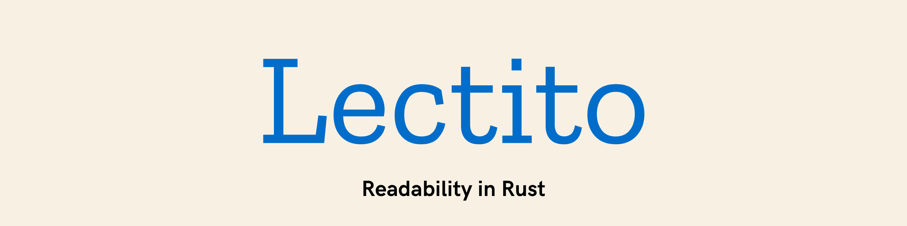

This is the source code for Lectito, containing the library, CLI, & documentation.

## What is Lectito?

Lectito is a library and command-line tool to extract readable content from HTML.
It's an augmented, Rust implementation of the Mozilla Readability algorithm.

<!-- TODO: docs.rs & book link -->

Learn more by reading the [docs](/TODO.md) and the [book](/TODO.md)

## Quick Start

Install the command-line tool:

```sh
cargo install lectito-cli
lectito https://example.com/article --format markdown
```

Use the Rust library when your application already has HTML:

```rust
use lectito::{extract, ReadabilityOptions};

fn main() -> Result<(), lectito::Error> {
    let html = r#"
        <article>
            <h1>Readable HTML in Rust</h1>
            <p>Lectito extracts the article body and removes page chrome.</p>
            <p>It returns cleaned HTML, Markdown, plain text, and metadata.</p>
        </article>
    "#;

    let options = ReadabilityOptions { char_threshold: 0, ..Default::default() };
    let article = extract(html, Some("https://example.com/post"), &options)?
        .expect("example article should be readable");

    println!("{}", article.markdown);
    Ok(())
}
```

Run the checked example in this repo:

```sh
cargo run -p lectito-basic-example
```

## Installation

### Library

```sh
cargo add lectito
```

or add it to `Cargo.toml`:

```toml
[dependencies]
lectito = "0.1"
```

### CLI

```sh
cargo install lectito-cli
```

### Local Development

With an up to date [Rust toolchain](https://rustup.rs/), clone the repo and
then check out the [local dev guide](/DEVELOPMENT.md).

## License

[MPL 2.0](https://www.mozilla.org/MPL/2.0/)
